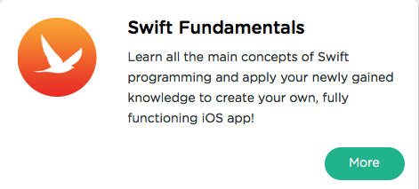

```
Roberto Nogueira  
BSd EE, MSd CE
Solution Integrator Experienced - Certified by Ericsson
```
# Sololearn Swift



**About This Tutorial**

Hands-on practice: Collect points by writing real-life Swift code within the app. 
Most importantly - and most fun: SoloLearn's Swift app lets you apply your newly gained knowledge and create your own, fully functioning iOS app!
While no prior experience is required, we do recommend that you have some basic knowledge of programming in order to enjoy the full benefits of the course.

We cover Swift's basic concepts, control flow, collections, functions, closures, object-oriented programming, and much more!

[Sololearn Swift](https://www.sololearn.com/Course/Swift/)

#### Topics
```
Swift Fundamentals
[x] The Basic
[ ] Control Flow and Collections
[ ] Functions and Closures
[ ] Object Oriented Programming
[ ] Your First iOS App
[ ] Certificate
```

